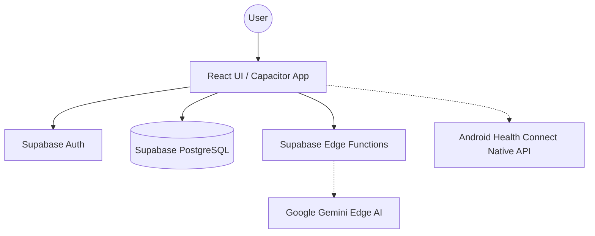

# System Architecture

## Top-Level Architecture (C4 Context)

## Core Architecture Decisions

### Supabase + Edge AI
- **Database & Auth**: Supabase was chosen for tight integration of Postgres, Realtime, and robust RLS. 
- **Edge AI**: Deno-based Supabase Edge Functions encapsulate the intelligence, specifically connecting to Gemini models. By running on the edge, we offload intensive natural language parsing away from the mobile client and securely hold AI API keys out of the app bundle. 

### Mobile-First with Capacitor
- We have chosen a web-first stack wrapped by Capacitor rather than React Native. This enables a unified React 19 + Vite + Tailwind v4 codebase while still granting access to critical native layers on Android, like the Health Connect API, via Capacitor plugins.

## Cross-Cutting Concerns
- **Security**: Robust RLS ensures athletes can only see their own data while allowing coaches a broader secure view. All Edge Functions enforce Supabase Auth header validation.
- **Environment Boundaries**: Clear separation between the web/mobile client UI, Supabase Edge Functions for secure serverless logic, and the core PostgreSQL database.
- **Offline First considerations**: Future adaptations account for caching mechanisms (like Dexie) for offline availability, synchronizing outboxes when connectivity is restored.
