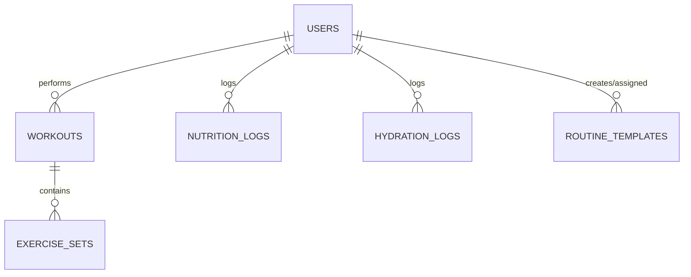

# Backend Documentation

## Database Schema (ERD)

## Design Decisions

### RLS Recursion Fixes
- **The Problem**: Checking `role = 'coach'` using an inline subquery against `public.users` within policies creates an infinite loop.
- **The Solution**: Encapsulated role checks in a `SECURITY DEFINER` function (`public.is_coach()`). This guarantees the function executes with bypass permissions to inspect `public.users` safely, avoiding the recursive trigger on the table's own policies.

### Constraints & Integrity
- Strict Foreign Keys between users, workouts, sets, and templates.
- Enforced cascade delete logic to prevent orphaned rows across the system.

## Serverless Edge AI (Deno/Gemini)

### Nutrition Parsing (`parse-nutrition`)
- **Fallback Chain**: Uses a resilient model fallback sequence: `gemini-3.6-flash` → `gemini-3.5-flash` → `gemini-3.1-flash-lite`.
- Parses conversational diet logs and extracts multi-dish macros securely.

### Secure Provisioning (`create-athlete`)
- A secure admin-only workflow required to provision new athlete authentication identities and insert profile records concurrently.

### API Contracts
Edge functions run purely externally. Explicitly define request and response payload shapes:
- **`parse-nutrition` Request**: `{ text: string }`
- **`parse-nutrition` Response**: `{ dishes: Array<{ name, energy, protein, ... }> }`
- **`create-athlete` Request**: `{ email, password, name }`
- **`create-athlete` Response**: `{ user_id, message }`
