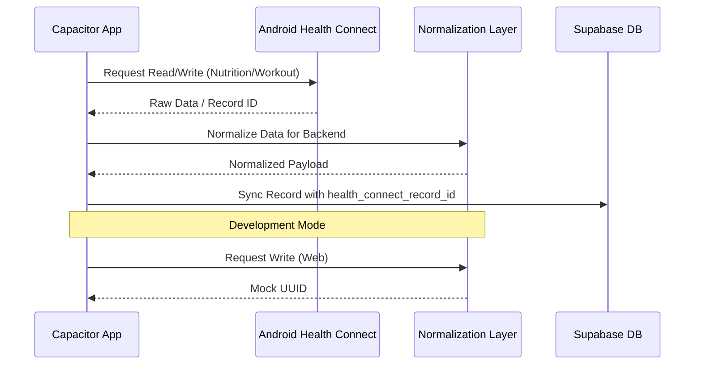

# Mobile Health Integration

## Data Flow Sequence

## Design Decisions

### Health Connect Plugin Choice
- Attempted to use multiple plugins. Both `@devmaxime/capacitor-health-connect` (read-only) and `@capgo/capacitor-health` (incomplete macro support) proved insufficient. 
- **Selected**: `@kiwi-health/capacitor-health-connect` strictly for its robust write mechanisms covering Protein, Carbohydrate, Fat, Fiber, and Exercise Sessions.

### Fallback Strategies
- Because Health Connect is strictly native Android, we maintain `src/services/health/index.ts` abstracting out Health Connect. If `Capacitor.isNativePlatform()` is false, mock services return mock UUIDs to ensure uninterrupted web-based development.

### Native Build Quirks
- The `android/app/src/main/AndroidManifest.xml` must explicitly include permission `<queries>` for `com.google.android.apps.healthdata` and alias activities specifically for `VIEW_PERMISSION_USAGE` in API >= 34.
- Dependency pinning is strictly enforced on `^7.0.0` for all Capacitor core/cli/android packages to maintain compatibility with the kiwi-health plugin.
